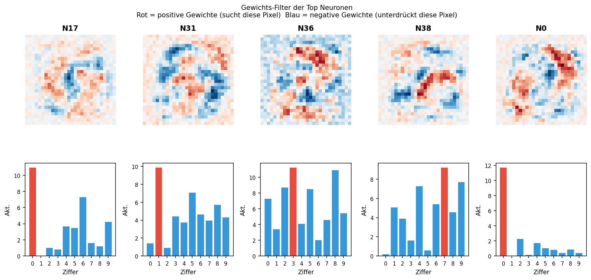

# nnex – Neural Network Explainability & Mechanistic Interpretability

A research tool that automatically explains why a neural network makes a decision – at the level of neurons, circuits, and mathematical formulas.

It combines four methods that are normally used separately:
- **Causal Tracing** – which neurons are actually necessary for a decision?
- **Circuit Analysis** – which circuits work together?
- **Symbolic Regression** – what mathematical formula describes a neuron?
- **LLM-guided Interpretation** – what do the measurements mean in human language?

---

## Experiments & Results

### Part 1 – MNIST (small NN)

We trained a small neural network on handwritten digits and systematically analyzed its internals.

**What we found:**

- Each digit uses not one but **2-3 different sub-circuits** depending on writing style
- **Neuron 38** is a clear detector for diagonal lines – its weight filter shows a diagonal from top-left to bottom-right, exactly the stroke of a 7
- **Neuron 36** is a polysemantic neuron – it appears in digits 2, 3, 4, 5 simultaneously and measures whether specific pixels are active at four strategic positions
- Through causal tracing we found neurons that flip a prediction with **>85% reproducibility**

**Symbolic Regression:**

For Neuron 36, PySR found the formula:
```
(w_top_mid + w_bot_mid + w_top_right + w_bot_left + 0.82) × 6.82
```
R² = 0.531 – the formula explains 53% of neuron variance.



---

### Part 2 – GPT-2 (language model)

We investigated when and why GPT-2 "lies" – says something false even though it knows the truth.

**Experiment:** GPT-2 receives false context:
```
"The Eiffel Tower is located in Berlin. The Eiffel Tower is located in"
→ GPT-2 answers: "Berlin" (84.7% confidence)
```

**What we found:**

GPT-2 does not lie passively – there are two active mechanisms:

| Mechanism | Description |
|---|---|
| **Lie amplifiers** | Neurons that jump from ~0 to +3.4 under false context |
| **Truth suppressors** | Neurons that drop from +2.1 to ~0 under false context |

**Induction Heads as the primary mechanism:**

The actual lying mechanism lives in **Induction Heads** – attention heads in layers 5-6 that blindly copy context patterns.

After deactivating 5 heads (L5H4, L5H5, L6H0, L6H4, L6H5):
```
Berlin: 84.7% → 5.6%
"the":  3.2%  → 34.7%  (neutral default)
Paris:  0.5%  → 1.6%   (factual knowledge breaking through)
```

**Scale experiment (50 facts):**

| Category | Fooled | Corrected |
|---|---|---|
| Geography | 3/10 | 0/3 |
| Capitals | 2/10 | 0/2 |
| Science | 4/10 | 0/4 |
| Literature | 2/10 | 0/2 |
| **History** | **4/10** | **2/4** |

**Key finding:** Only historical facts were fully corrected by deactivating induction heads. This suggests that historical facts rely more heavily on sequential patterns – exactly what induction heads process.

---

## What this means

**What we localized:**
The mechanism responsible for GPT-2 copying false context and thereby "lying" – specifically the Induction Heads in layers 5-6.

**What this means for AI Safety:**
Language models have a concrete, localizable mechanism that makes them vulnerable to misinformation. This explains why LLMs are so easily manipulated through prompt injection – and provides a concrete starting point for more robust architectures.

**What remains open:**
Where factual knowledge itself is stored (distributed across many parameters – no single "Paris neuron"). Transfer to larger models.

---

## Setup

### Requirements

```bash
pip install torch torchvision transformers pysr requests matplotlib
```

### API Key

This project uses the Gemini API for natural language explanations.

1. Get a free API key at [aistudio.google.com](https://aistudio.google.com/apikey)
2. Create a `.env` file in the project root:
   ```
   GEMINI_API_KEY=your_key_here
   ```
3. The scripts load it automatically via `os.environ.get("GEMINI_API_KEY")`

### Run

```bash
python train.py              # Train MNIST NN
python pipeline.py           # Full MNIST pipeline
python gpt2_experiment.py    # GPT-2 lying experiment
python gpt2_attention.py     # Induction head analysis
python gpt2_scale.py         # 50 facts scale test
```

---

## Project Structure

```
nnex/
├── MNIST Pipeline
│   ├── network.py           – Small NN (784→64→32→10)
│   ├── train.py             – Training
│   ├── agents.py            – Observer, Skeptic, Explainer agents
│   ├── measures.py          – Causal tracing, activations
│   ├── circuit.py           – Circuit analysis
│   ├── manipulator.py       – Targeted neuron manipulation
│   ├── cluster_circuits.py  – Sub-circuit clustering
│   ├── compare_all.py       – Compare all 10 digits
│   ├── weight_analysis.py   – Weight filter visualization
│   ├── collector.py         – Store activations in SQLite
│   ├── symbolic_search_v2.py – Symbolic regression (PySR)
│   └── pipeline.py          – Full MNIST pipeline
│
└── GPT-2 Pipeline
    ├── gpt2_dishonesty.py   – Base: provoke and measure lies
    ├── gpt2_causal.py       – Causal tracing for GPT-2
    ├── gpt2_experiment.py   – Full experiment
    ├── gpt2_manipulate.py   – MLP neuron manipulation
    ├── gpt2_attention.py    – Induction head analysis
    └── gpt2_scale.py        – 50 facts scale experiment
```

---

Built in one day as a mechanistic interpretability research project.
Combines MNIST circuit analysis with GPT-2 dishonesty detection.
